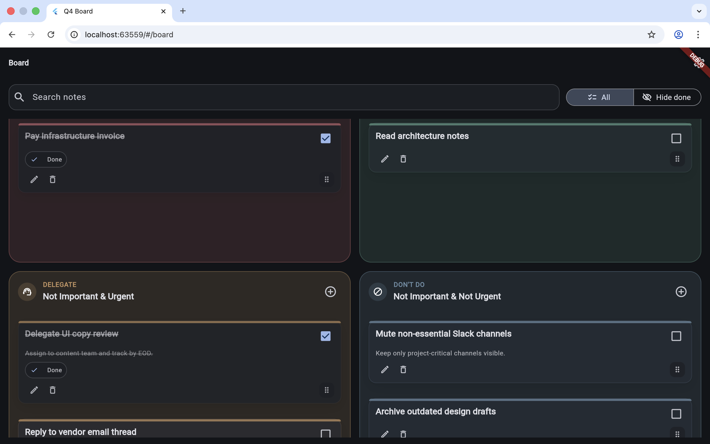
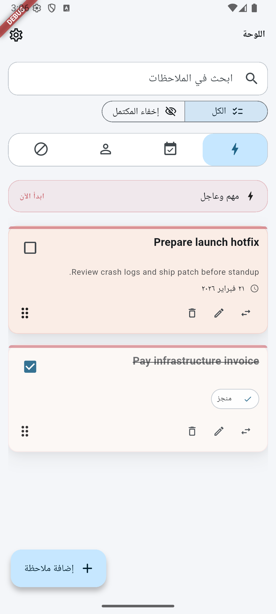

# Q4 Board — Eisenhower Matrix

Q4 Board is a bilingual productivity app based on the Eisenhower Matrix.
Arabic name: **لوحة الأولويات (مصفوفة آيزنهاور)**.

It helps you classify tasks into 4 quadrants and prioritize execution with a sticky-note board experience.

## Live Demo

- Web (Vercel): [q4.abdallahgaber.dev](https://q4.abdallahgaber.dev/)

## Features (Phase 1)

- Local-first storage with Hive (offline by default)
- 4-quadrant Eisenhower board (Q1/Q2/Q3/Q4)
- Manual drag/reorder with persisted ordering
- Move notes between quadrants
- Search across notes
- Show/hide done filtering
- Undo for delete and move actions
- Arabic/English localization (RTL support)
- Light/Dark/System themes
- Responsive UX for web/mobile/desktop

## Tech Stack

- Flutter
- Riverpod
- GoRouter
- Hive
- Flutter i18n (`arb`)

## Getting Started

### Prerequisites

- Flutter SDK installed
- A device/emulator/simulator for your target platform

### Install dependencies

```bash
flutter pub get
```

### Run (Web)

```bash
flutter run -d chrome
```

### Run (Android)

```bash
flutter run -d android
```

### Run (iOS)

```bash
flutter run -d ios
```

### Run (macOS)

```bash
flutter run -d macos
```

## Project Structure

```text
lib/
  core/          # app-wide theme, routing, design tokens, helpers
  domain/        # entities + repository/service contracts
  data/          # Hive models/adapters + repository implementations
  features/      # board, note editor, settings
  l10n/          # ARB files + generated localization output

integration_test/ # end-to-end / smoke test flows

Docs/
  docs/          # roadmap, architecture, decisions, contributing
```

## Screenshots

### Web — Light Mode

<p align="center">
  
</p>

### Web — Dark Mode

<p align="center">
  
</p>

### Mobile — Android

<p align="center">
  
</p>

## Branding Assets (Temporary)

This repo currently uses a temporary generated Q4 mark for app icon/splash branding.

Generate branding source assets:

```bash
# Requires ImageMagick (`magick`) installed locally.
./tool/generate_branding_assets.sh
```

Regenerate platform icons and splash assets:

```bash
dart run flutter_launcher_icons
# Android + Web native splash (plugin config currently excludes iOS/macOS)
dart run flutter_native_splash:create
```

## Roadmap

- **Phase 1**: Local-first MVP (done)
- **Phase 2**: Authentication + cloud sync (planned)
- **Later phases**: richer planning workflows, productivity insights, and integrations

See [`docs/ROADMAP.md`](docs/ROADMAP.md) for details.

## Known Issues

- Desktop/Web drag can still show a visual jump/snap at drag start in some cases. This is tracked and will be improved in a coming UI iteration.
- Minor drag-feel differences may appear across browsers because pointer/drag behavior differs by engine.
- macOS native splash customization is limited in the current generator setup; Android/Web splash is branded, macOS currently relies on icon + default startup window.

## Quality Checks

```bash
flutter analyze
flutter test
flutter test integration_test/app_smoke_test.dart -d macos
```

Note: `integration_test` on macOS can fail when the repo is inside a cloud-synced folder (for example OneDrive) because injected file metadata may break codesigning of the temporary app bundle.
